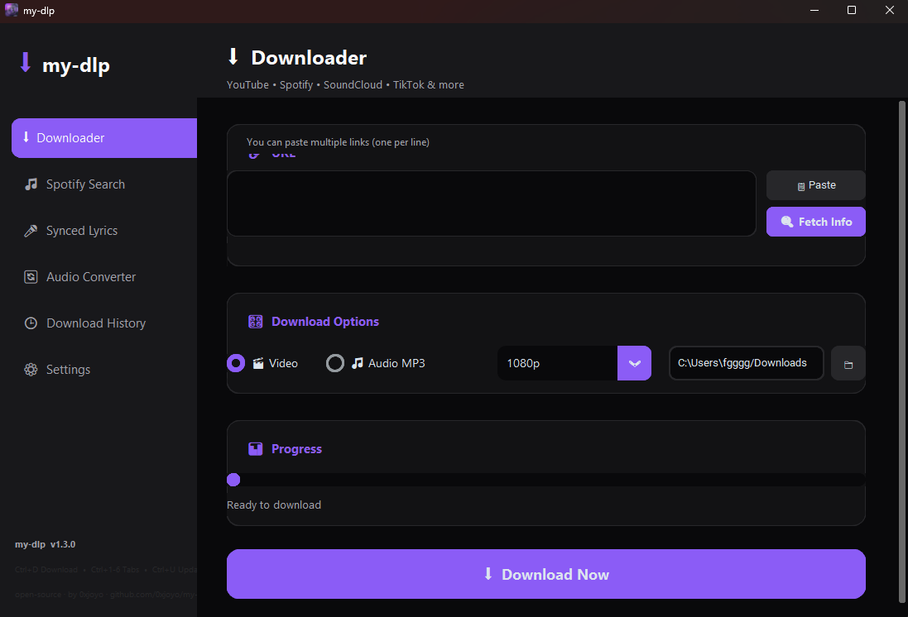
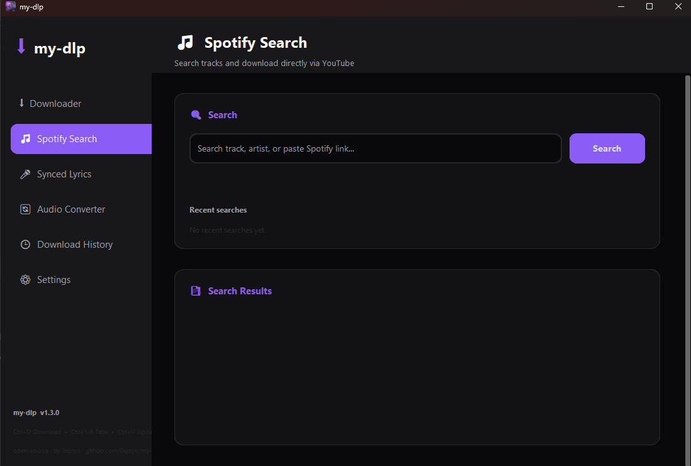
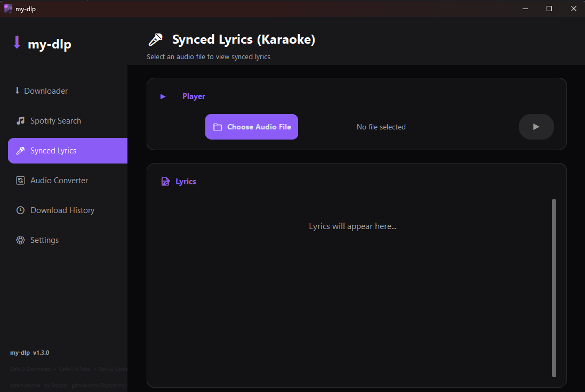

# my-dlp

> A modern, premium desktop client for [yt-dlp](https://github.com/yt-dlp/yt-dlp).
> Download video and audio from YouTube, Spotify, SoundCloud, TikTok, and
> hundreds of other sites. Search tracks, fetch synced lyrics, embed cover
> art, and keep your library tidy — all from a sleek, dark-mode UI available
> in English and Arabic.


---

## Highlights

- **Multi-platform downloads.** YouTube, Spotify, SoundCloud, TikTok, Twitter/X, Instagram, Facebook, Vimeo, and 1500+ other sites via `yt-dlp`.
- **Video and audio in one place.** Choose any resolution up to 4K for video, or extract audio as MP3 / M4A / FLAC / WAV / AAC with bitrates from 128 to 320 kbps. Cover art and full metadata are embedded automatically.
- **Playlist support.** Download a whole YouTube or Spotify playlist in one click, with proper per-track filenames (`01 - Track Name.mp3`, `02 - ...`, ...).
- **Spotify search without API keys.** Type a track or artist name into the Spotify tab and get instant YouTube Music matches with fuzzy ranking — you don't need to register a Spotify developer app just to download songs.
- **Synced Lyrics Karaoke.** Pick any local audio file; the app fetches its synced `.lrc` lyrics from LRCLIB or syncedlyrics and plays them with live highlight as the song progresses. Supports both standard `[mm:ss.xx]` and extended `[hh:mm:ss.xx]` formats.
- **Audio converter.** Convert any local audio file between MP3, M4A, FLAC, WAV, and AAC without leaving the app.
- **Auto-update notifications.** When a new version is published on GitHub, the app pops up a bilingual changelog dialog the next time it launches. Dismissable per-version, with a subtle red badge in the sidebar so you can re-open it later.
- **System tray integration.** Close the window to keep the app running in the background; bring it back from the tray with one click. Includes a manual "Check for updates" entry.
- **Multi-language UI.** Full Arabic and English translations of every label and message.
- **Cross-platform.** Tested on Windows 10/11; runs on Linux (X11 / Wayland) and macOS with the same feature set. Config and history live in the OS-appropriate user data directory (`%APPDATA%/my-dlp` on Windows, `~/.config/my-dlp` on Linux).

---

## Table of contents

1. [Screenshots](#screenshots)
2. [Installation](#installation)
   - [Windows](#windows)
   - [Linux](#linux)
   - [macOS](#macos)
   - [From source](#from-source)
3. [Requirements](#requirements)
4. [Usage](#usage)
5. [Features in detail](#features-in-detail)
6. [Configuration](#configuration)
7. [Build it yourself](#build-it-yourself)
8. [Project structure](#project-structure)
9. [Troubleshooting](#troubleshooting)
10. [Contributing](#contributing)
11. [License & credits](#license--credits)

---

## Screenshots

| Downloader tab | Spotify search | Synced lyrics |
|----------------|----------------|----------------|
|  |  |  |

> Screenshots will be added in a follow-up. Run the app to see the dark, glassmorphism-inspired UI in action.

---

## Installation

### Windows

#### Option A: installer (recommended)

1. Download the latest `my-dlp_v*_installer.exe` from the [Releases](https://github.com/0xjoyo/my-dlp/releases) page.
2. Double-click the installer. It will offer you a desktop shortcut and will install to `C:\Program Files\my-dlp`.
3. Launch `my-dlp` from the Start menu or the desktop shortcut.

The installer bundles the Python runtime, all required libraries, and ffmpeg is **not** needed for audio — only for video postprocessing, which uses yt-dlp's bundled ffmpeg automatically.

#### Option B: portable ZIP

1. Download `my-dlp_v*_portable.zip` from the [Releases](https://github.com/0xjoyo/my-dlp/releases) page.
2. Extract it anywhere (a USB stick works).
3. Run `my-dlp\my-dlp.exe`.

No installer, no admin rights, no registry entries. Settings still live in `%APPDATA%\my-dlp\`.

---

### Linux

my-dlp runs on any modern Linux distribution. There are three ways to install it:

#### Option A: AppImage (recommended, distro-agnostic)

```bash
# Download the latest AppImage from the Releases page, then:
chmod +x my-dlp_v*_x86_64.AppImage
./my-dlp_v*_x86_64.AppImage
```

Optional: integrate it into your desktop environment.

```bash
# Ubuntu / Debian
sudo apt install libfuse2

# Fedora / RHEL
sudo dnf install fuse-libs
```

#### Option B: Debian / Ubuntu (.deb)

```bash
wget https://github.com/0xjoyo/my-dlp/releases/latest/download/my-dlp_v*_amd64.deb
sudo apt install ./my-dlp_v*_amd64.deb
my-dlp
```

#### Option C: Fedora / RHEL (.rpm)

```bash
wget https://github.com/0xjoyo/my-dlp/releases/latest/download/my-dlp_v*_x86_64.rpm
sudo dnf install ./my-dlp_v*_x86_64.rpm
my-dlp
```

#### System packages you still need

```bash
# Debian / Ubuntu
sudo apt install python3 python3-pip python3-tk vlc libvlc-dev ffmpeg

# Fedora
sudo dnf install python3 python3-pip python3-tkinter vlc vlc-devel ffmpeg

# Arch / Manjaro
sudo pacman -S python python-pip tk vlc ffmpeg
```

The VLC and ffmpeg packages are only needed for the Synced Lyrics tab (VLC) and for video postprocessing (ffmpeg). Audio-only downloads work without either.

---

### macOS

Download the latest `my-dmp_v*_x86_64.dmg` (Intel) or `my-dlp_v*_arm64.dmg` (Apple Silicon) from the [Releases](https://github.com/0xjoyo/my-dlp/releases) page, open it, and drag `my-dlp.app` to your Applications folder.

You'll also need:

```bash
brew install python@3.11 python-tk ffmpeg vlc
```

(The Karaoke tab requires VLC. Audio downloads work without it.)

---

### From source

If you'd rather run the Python sources directly:

```bash
git clone https://github.com/0xjoyo/my-dlp.git
cd my-dlp
pip install -r requirements.txt
python main.py
```

This works on Windows, Linux, and macOS. The only platform-specific requirement is `python-vlc`, which on Linux needs `libvlc-dev` to be installed first.

---

## Requirements

### Runtime

| | Minimum | Recommended |
|---|---|---|
| **OS** | Windows 10 / macOS 11 / Ubuntu 20.04 | Windows 11 / Ubuntu 22.04 / macOS 13 |
| **Python** *(source builds only)* | 3.10 | 3.11+ |
| **RAM** | 256 MB | 512 MB |
| **Disk** | 200 MB | 500 MB+ (for downloads) |
| **Display** | 1024×768 | 1280×800 or higher |

### System libraries *(Linux / macOS only)*

- `python3-tk` / `python-tk` — Tkinter bindings used by CustomTkinter
- `libvlc` + `vlc` — required by the Synced Lyrics tab
- `ffmpeg` — required for video postprocessing (merged audio/video, embed-thumbnail for video). Audio-only downloads do not need ffmpeg if you keep the bundled one shipped with yt-dlp.

### Python packages

See [`requirements.txt`](requirements.txt). All of them install cleanly via `pip` on every supported platform.

---

## Usage

### Download a single video

1. Open the **Downloader** tab.
2. Paste the URL (YouTube, Spotify, SoundCloud, TikTok, ...).
3. Click **Fetch Info** to preview metadata and available qualities.
4. Pick video or audio mode, pick a quality, pick a destination folder.
5. Click **Download Now**.

### Download a playlist

Paste a playlist URL into the same textbox — yt-dlp auto-detects it and the file names are prefixed with the track index (`01 - Title.mp3`, `02 - Title.mp3`, ...).

### Search Spotify

1. (Optional) Add your Spotify Client ID and Secret in the **Settings** tab if you want to fetch Spotify track / playlist metadata directly. **You can skip this step** — the search box also searches YouTube Music and ranks results by fuzzy similarity, so track downloads work without a Spotify developer account.
2. Go to the **Spotify Search** tab.
3. Type a song or artist name and hit Enter.
4. Click **Download Audio** on the result you want.

### Synced lyrics karaoke

1. Download or pick any local MP3 / M4A / FLAC / WAV / OGG file.
2. Open the **Synced Lyrics** tab.
3. Click **Choose Audio File**.
4. The app fetches a synced `.lrc` automatically. Press **Play**.

### Convert audio

Open the **Audio Converter** tab, pick a source file and a target format / quality, then click **Convert Now**.

### System tray

Close the main window with the X button. The app stays running in your system tray with a menu for show / hide, manual update check, and quit. Right-click the tray icon for the menu.

### Keyboard shortcuts

| Shortcut | Action |
|---|---|
| `Ctrl+D` | Jump to the Downloader tab |
| `Ctrl+1` .. `Ctrl+6` | Jump to tabs 1-6 |
| `Ctrl+V` | Paste a URL into the Downloader tab and switch to it |
| `Ctrl+U` | Manually check for updates |

---

## Features in detail

### Embedded cover art & metadata

For every audio download, the app embeds:

- Track title and artist (overridable via the in-app tag editor — open the **Downloader** tab, paste a URL, click **Fetch Info**, edit the title/artist fields, then **Download Now**)
- Album, year, and track number from yt-dlp's parsed info
- Album art (converted to JPEG and embedded directly into the MP3 / M4A / FLAC file)

Supported output formats: MP3, M4A, FLAC, WAV, AAC.

### Multi-language UI

Switch between English and Arabic in the **Settings** tab. The change is applied instantly without a restart. All UI strings live in `src/utils/i18n.py` and are easy to extend to a new language — just copy a block and translate.

### Per-update dismiss

The auto-update pop-up shows once per version. Click **Skip this version** to never be asked again about *this* version; click **Later** to just hide it for now (the badge in the sidebar lets you re-open it). If a *newer* version comes out, the pop-up comes back.

### Persistent history

Every successful download is recorded in `history.json` (in the user config directory). The **History** tab shows it as a scrollable list with file size, date, and a "Show in folder" button.

---

## Configuration

Settings live in `config.json` in your user data directory:

| OS | Path |
|---|---|
| Windows | `%APPDATA%\my-dlp\config.json` |
| macOS | `~/Library/Application Support/my-dlp/config.json` |
| Linux | `$XDG_CONFIG_HOME/my-dlp/config.json` (default `~/.config/my-dlp/config.json`) |

You can override the location with the `MY_DLP_CONFIG_DIR` environment variable (useful for portable installs).

The history file lives next to it: `<config-dir>/history.json`.

### Keys you can set

| Key | Default | Meaning |
|---|---|---|
| `download_path` | `~/Downloads` | Default destination folder |
| `appearance_mode` | `dark` | `dark` / `light` / `system` |
| `language` | `en` | `en` / `ar` |
| `default_video_format` | `mp4` | `mp4` / `mkv` / `webm` |
| `default_audio_format` | `mp3` | `mp3` / `m4a` / `flac` / `wav` / `aac` |
| `default_video_quality` | `1080p` | `4K` / `1080p` / `720p` / `480p` / `360p` |
| `default_audio_quality` | `192kbps` | `320kbps` / `192kbps` / `128kbps` |
| `ffmpeg_path` | `""` | Absolute path to `ffmpeg.exe` if it's not on PATH |
| `embed_thumbnail` | `true` | Embed cover art into audio files |
| `embed_lyrics` | `true` | Write metadata tags (always enabled now; kept for back-compat) |
| `speed_limit` | `0` | Per-download rate limit in KB/s (`0` = unlimited) |
| `lyrics_provider` | `lrclib` | `lrclib` / `syncedlyrics` |
| `spotify_client_id` | `""` | Optional — Spotify Developer Dashboard credentials |
| `spotify_client_secret` | `""` | Optional — Spotify Developer Dashboard credentials |
| `update_dismissed_version` | `""` | Set automatically; the version the user skipped |

---

## Build it yourself

```bash
git clone https://github.com/0xjoyo/my-dlp.git
cd my-dlp
pip install -r requirements.txt
```

### Build a standalone executable (Windows / Linux)

```bash
python build.py
```

This produces `dist/my-dlp/`. Run `dist/my-dlp/my-dlp` (or `my-dlp.exe` on Windows) directly.

### Build a Windows installer

Requires Inno Setup 6: https://jrsoftware.org/isinfo.php

```bash
# After running build.py:
iscc setup.iss
```

This produces `dist/my-dlp_v*_installer.exe`.

### Build a portable zip

```bash
# From the project root, after running build.py:
python -c "
import zipfile, os
with zipfile.ZipFile('dist/my-dlp_portable.zip', 'w', zipfile.ZIP_DEFLATED) as zf:
    for root, _, files in os.walk('dist/my-dlp'):
        for f in files:
            if f in ('history.json', 'config.json'):
                continue
            fp = os.path.join(root, f)
            zf.write(fp, os.path.relpath(fp, 'dist'))
"
```

---

## Project structure

```
my-dlp/
├── main.py                     # Entry point
├── build.py                    # PyInstaller build script
├── setup.iss                   # Inno Setup installer script
├── requirements.txt
├── README.md
├── CHANGELOG.md
├── VERSION                     # Single source of truth for the version
├── assets/
│   ├── icon.ico                # Windows icon
│   └── icon.png                # Cross-platform icon
└── src/
    ├── core/
    │   ├── downloader.py       # yt-dlp wrapper + metadata + cover art
    │   ├── info_fetcher.py     # Video/playlist metadata + thumbnail
    │   ├── spotify_search.py   # Spotify API + YouTube Music fallback
    │   ├── lyrics_fetcher.py   # LRCLIB / syncedlyrics providers
    │   ├── lrc_parser.py       # LRC parser (incl. [hh:mm:ss.xx] support)
    │   ├── audio_player.py     # VLC-based karaoke player
    │   └── updater.py          # GitHub Releases auto-update checker
    ├── ui/
    │   ├── app.py              # Main window + sidebar nav + tray hook
    │   ├── downloader_tab.py
    │   ├── spotify_tab.py
    │   ├── lyrics_tab.py
    │   ├── converter_tab.py
    │   ├── history_tab.py
    │   ├── settings_tab.py
    │   └── update_dialog.py    # Bilingual update pop-up
    └── utils/
        ├── config_manager.py   # config.json (per-user) with cross-OS paths
        ├── history_manager.py  # history.json
        ├── helpers.py          # Filename / URL / format helpers
        └── i18n.py             # All UI strings (en + ar)
```

---

## Troubleshooting

**`ModuleNotFoundError: vlc`** — The Karaoke tab can't find libvlc. Install VLC media player from your OS package manager.

**`No supported JavaScript runtime could be found`** — YouTube extraction requires a JavaScript runtime (deno, node, or quickjs). Install one:

```bash
# Linux
sudo apt install nodejs   # or: sudo apt install deno
```

The `Settings` tab has a **🔄 Update yt-dlp** button — running that regularly also keeps extraction working as YouTube changes.

**`ffmpeg not found`** during video download — Install ffmpeg (see the Linux / macOS install sections above) or set the explicit path in **Settings → ffmpeg path**.

**Cover art missing after download** — Make sure **Settings → Embed thumbnail in audio file** is checked. The image is fetched from the source URL, so if the source doesn't have one, the file just won't have a cover.

**Update pop-up never appears** — The check runs ~1.5 seconds after startup and requires internet access to `api.github.com`. Some corporate firewalls block it.

**App crashes silently on Linux with no display** — Run with a virtual framebuffer (Xvfb) or, better, use Wayland / X11 with a desktop session.

---

## Contributing

Contributions are welcome. Open an issue first to discuss substantial changes, then send a pull request against `main`. The codebase is Python with CustomTkinter for the UI and standard `subprocess` / `threading` for the heavy lifting — no exotic build steps.

The version lives in [`VERSION`](VERSION) (a single line of text). Bump it whenever you make a release-worthy change; the updater reads it at runtime.

---

## License & credits

This project is open source under the [MIT License](LICENSE).

It is built on top of these excellent open-source projects:

- [yt-dlp](https://github.com/yt-dlp/yt-dlp) — the download engine
- [CustomTkinter](https://github.com/TomSchimansky/CustomTkinter) — the modern Tkinter theme
- [Pillow](https://github.com/python-pillow/pillow) — image handling
- [spotipy](https://github.com/spotipy/spotipy) — Spotify Web API client
- [ytmusicapi](https://github.com/sigma67/ytmusicapi) — YouTube Music unofficial API
- [syncedlyrics](https://github.com/0x7c4/syncedlyrics) — multi-provider lyrics search
- [python-vlc](https://github.com/oaubert/python-vlc) — bindings for the VLC media player
- [mutagen](https://github.com/quodlibet/mutagen) — audio metadata editor
- [pystray](https://github.com/moses-palmer/pystray) — cross-platform system tray
- [pyinstaller](https://github.com/pyinstaller/pyinstaller) + [Inno Setup](https://jrsoftware.org/isinfo.php) — packaging

---

## AI-assisted design disclosure

This project — including its architecture, the bug fixes across all releases, the bilingual UI strings, the auto-update flow, the system tray integration, and this very README — was designed and implemented with significant assistance from an AI coding agent (Hermes Agent by Nous Research), guided by the human author 0xjoyo.

The AI served as a co-implementer and reviewer: every line of code was reviewed, tested, and shipped by a human. All architectural decisions, feature scoping, and final acceptance were made by the human maintainer.

We believe in being transparent about how software is built. If you find a bug or have a suggestion, please open an issue — humans and AI both read them.